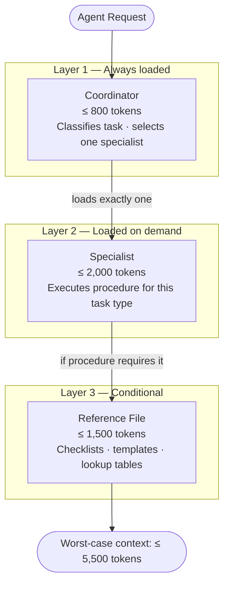
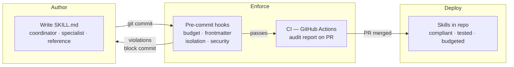

# Skill Governance

A specification-driven framework for keeping LLM agent skills fast, focused, and under budget.

## The Problem

LLM agent skills (SKILL.md files) degrade agent performance when they grow without constraints. A 3,000-token skill that worked in testing becomes a 6,000-token skill after a few weeks of additions — bloating every context window it loads into, crowding out the user's actual task, and making the agent slower and less accurate. Without structural enforcement, skills accumulate prose, duplicate content, cross-reference each other, and quietly exceed the context budget that made them effective in the first place.

## What This Provides

### Token Budget Enforcement

Every skill type has a token ceiling: coordinators (800), specialists/standalone (2,000), references (1,500). Budgets are checked at commit time and in CI. Per-skill overrides are supported when backed by eval data.

### Progressive Loading Architecture

Skills use a three-layer architecture — coordinator, specialist, reference — so the agent only loads what it needs for the current task. A coordinator classifies the request and loads one specialist. The specialist loads reference files conditionally. The worst-case context load for any single path through a suite is capped at 5,500 tokens.

### Pre-Commit Hooks

Seven hooks run in under 2 seconds: token budgets, frontmatter validation, reference integrity, cross-skill isolation, prose detection, suite context load, and conventional commit messages. Four block commits (structural issues); three are advisory (quality signals).

### Scaffolding and CLI Tools

`skill-new` and `skill-new-suite` scaffold compliant skills from templates. `skill-check` runs all hooks on a skill directory. `skill-audit` runs a full compliance report with hard failures and advisory warnings. `skill-budget` and `skill-wc` give quick token counts.

### Writing Rules That Prevent Bloat

Procedure steps must be imperative sentences — no explanatory prose. Decision points are inline conditionals — no nested sub-sections. One output example per skill. Reference files are pure content with no preamble. These rules are enforced by the prose detection hook and checked in code review.

### CI/CD Workflows

GitHub Actions workflows run the same checks as pre-commit hooks on every pull request. Budget reports, structural validation, and security scans run automatically.

### Security Scanning

Skills are scanned for credential references, prompt injection patterns, dangerous commands, and missing scope constraints. Suppressions are configured per-repo in `pipeline/config/security-suppressions.json`.

### Model Routing

Skills declare model preferences in frontmatter. Budget zones (green/yellow/red) trigger automatic model degradation — mechanical tasks use haiku, analytical tasks use sonnet, complex reasoning uses opus.

## Quick Start

### Starting fresh

```bash
curl -sSL https://raw.githubusercontent.com/dtsong/skill-governance/v1.3.0/install.sh \
  | bash -s -- --init
```

This installs hooks, configs, templates, CI workflows, and the governance directive into your skill repo. See the [Adopter Guide](ADOPTER-GUIDE.md) for the full walkthrough.

### Existing skills

If you already have SKILL.md files, follow [Path B in the Adopter Guide](ADOPTER-GUIDE.md#path-b-existing-skills-retrofit) — it walks through running an audit, fixing violations, and retrofitting governance onto your existing skills.

### Upgrading

```bash
curl -sSL https://raw.githubusercontent.com/dtsong/skill-governance/v1.3.0/install.sh \
  | bash -s -- --upgrade --version v1.3.0
```

Updates hooks and configs while preserving your local overrides.

## How It Works



The coordinator is always loaded. It reads the task, classifies it, and loads exactly one specialist. The specialist executes its procedure and conditionally loads reference files. At no point are multiple specialists or all references loaded simultaneously.

### Governance Workflow



> `install.sh` sets up hooks, config, templates, and CI workflows into your skill repo in one step.

## CI/CD Integration

`install.sh` installs four GitHub Actions workflows into your repo. Each maps to a distinct stage of the pipeline:

| Stage | Trigger | Checks | Blocking |
|-------|---------|--------|----------|
| 1 · Lint & Validate | Every push | Token budgets · frontmatter · reference integrity · cross-skill isolation | Yes — blocks merge |
| 2 · Static Analysis | Every PR | Pattern compliance · writing rules · portability · context load | Advisory — PR comment |
| 3 · Eval Execution | Merge to main · manual | Runs eval cases · regression detection | Yes — on regression |
| 4 · Publish | Release tag | Packages skills · version bump · distribute | — |

### What `install.sh` sets up

- `.github/workflows/skill-lint.yml` — Stage 1, runs on every push to `skills/**`
- `.github/workflows/skill-analyze.yml` — Stage 2, runs on every PR touching `skills/**`
- `.github/workflows/skill-eval.yml` — Stage 3, runs on merge to main; also manually dispatchable
- `.github/workflows/skill-publish.yml` — Stage 4, runs on `v*` tags
- `pipeline/scripts/` — validation, analysis, and eval scripts
- `pipeline/config/` — budget thresholds, security rules, routing config
- `.githooks/pre-commit` — local enforcement before commits reach CI

### What you need

- GitHub Actions enabled on your repo
- `ANTHROPIC_API_KEY` secret added to repo settings (Stage 3 eval execution only — Stages 1–2 have no API dependency)

### Customizing per repo

Per-skill budget overrides go in `pipeline/config/budgets.json` with a `reason` field. Security scan suppressions go in `pipeline/config/security-suppressions.json`. Both files are preserved on upgrade. See the [CI/CD Pipeline guide](guides/skill-cicd-pipeline.md) for the full configuration reference.

## Documentation

| Document | Description |
|----------|-------------|
| [Adopter Guide](ADOPTER-GUIDE.md) | Step-by-step onboarding for new and existing skill repos |
| [Governance Directive](directive/SKILL-GOVERNANCE-DIRECTIVE.md) | Compact rule summary for project instruction files |
| [Governance Spec](specs/SKILL-GOVERNANCE-SPEC.md) | Full specification — the source of truth |
| [Authoring Standard](guides/skill-authoring-standard.md) | Detailed rules for writing compliant skills |
| [Engineering Patterns](guides/skill-engineering-patterns.md) | Patterns library for common skill architectures |
| [Pre-Commit Hooks](guides/skill-precommit-hooks.md) | Hook implementation, configuration, and customization |
| [CI/CD Pipeline](guides/skill-cicd-pipeline.md) | GitHub Actions workflow setup |
| [Context-Efficient Architecture](guides/context-efficient-skill-architecture.md) | Deep dive on progressive loading design |
| [Building Eval Cases](guides/building-eval-cases-guide.md) | Guide for authoring skill eval cases |
| [Security Spec](specs/SKILL-SECURITY-SPEC.md) | Security hardening requirements |
| [Model Routing Spec](specs/SKILL-MODEL-ROUTING-SPEC.md) | Model selection and budget zone rules |
| [Trigger Reliability Spec](specs/SKILL-TRIGGER-RELIABILITY-SPEC.md) | Skill description formula for reliable activation |

## Shell Helpers

Source in your shell: `source pipeline/shell-helpers.sh`

| Command | Purpose |
|---------|---------|
| `skill-wc <file>` | Word and estimated token count |
| `skill-check <dir>` | Run all hooks on a skill directory |
| `skill-budget <file...>` | Check token budgets for specific files |
| `skill-audit` | Full compliance audit (hard + advisory) |
| `skill-new <name>` | Scaffold a new standalone skill |
| `skill-new-suite <name>` | Scaffold a new skill suite |
| `skill-load <suite-dir>` | Show context load breakdown for a suite |

## Repo Structure

```
skill-governance/
├── specs/                     # Normative specifications
├── directive/                 # Compact directives for instruction files
├── guides/                    # Authoring guides and patterns
├── pipeline/
│   ├── hooks/                 # Pre-commit hook scripts
│   ├── scripts/               # Analysis and validation scripts
│   ├── config/                # Default budgets, security, routing configs
│   ├── templates/             # Scaffolding for new skills and suites
│   ├── workflows/             # GitHub Actions CI workflows
│   ├── shell-helpers.sh       # CLI helpers
│   └── pre-commit-config.yaml # Hook definitions
└── install.sh                 # Installer for skill suite repos
```

## Versioning

Follows [semantic versioning](https://semver.org/). Major = breaking changes requiring migration. Minor = new features, backward compatible. Patch = bug fixes and clarifications.

Each suite tracks its installed version in `.governance-version`. The installer checks this during upgrades. Current version: see `VERSION` file.

## License

MIT. See [LICENSE](LICENSE).
